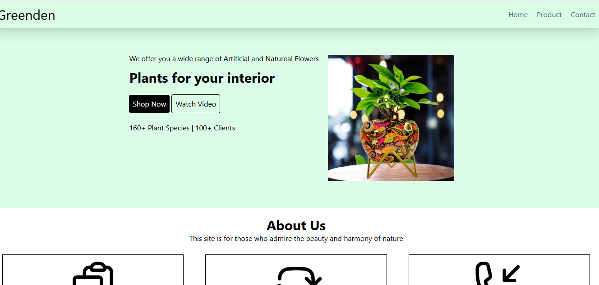
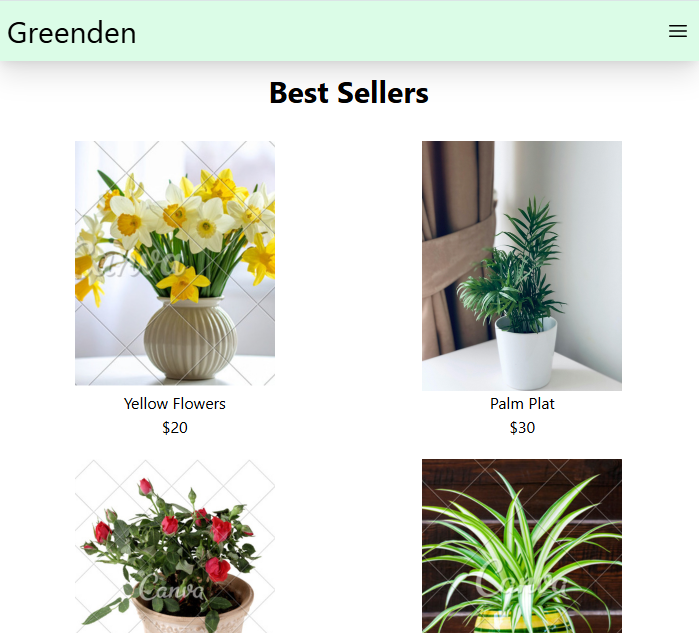

# 🌿 GreenDen – Plant Website

GreenDen is a responsive plant website built using **HTML, Tailwind CSS, and JavaScript**. It includes a home page, product page with dynamic search functionality, and a contact page.

## 🌐 Live Demo

🔗 [View Live Demo](https://inthusha20241647-commits.github.io/greeden-tailwind/)

## 📸 Screenshots

### 🖥️ Desktop View

<div align="center">
  
</div>

### 📱 Mobile View

<div align="center">
  
</div>

## ✨ Features

* 🏠 **Home Page**

  * Hero section
  * About Us
  * Best Sellers
  * Customer Reviews
  * Newsletter

* 🪴 **Product Page**

  * Responsive product grid
  * Product images and prices
  * Dynamic product search and filtering

* 📩 **Contact Page**

  * Contact form
  * Name, email, phone, company, and message fields

* 📱 **Responsive Design**

  * Mobile-friendly layout
  * Adaptive product grid

## 🛠️ Technologies Used

* 🌐 HTML5
* 🎨 Tailwind CSS
* ⚡ JavaScript
* 🖼️ SVG Icons

## 🔍 Product Search

The product page includes a JavaScript-powered search feature.

As users type a product name, matching products are displayed while non-matching products are hidden.

**Example:** Searching for `Rose` displays the matching Rose Plant products.

## 📂 Project Structure

```text
GreenDen/
├── index.html
├── product.html
├── contact.html
├── script.js
├── images/
└── src/
    └── output.css
```

## 🚀 How to Run Locally

1. Clone the repository.
2. Open the project in **VS Code**.
3. Open `index.html`.
4. Run using **Live Server** or open it directly in a browser.

## 🎯 Project Purpose

This project was created to practice:

* HTML page structure
* Tailwind CSS
* Responsive web design
* JavaScript DOM manipulation
* Search and filtering
* Multi-page navigation
* GitHub Pages deployment

---

🌿 **GreenDen – Bring Nature Into Your Space** 🌿
